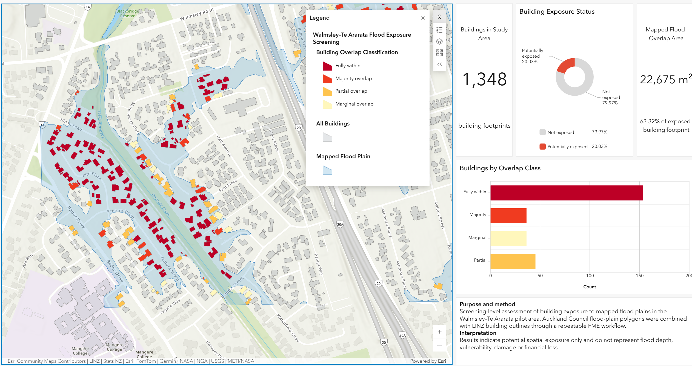

# Walmsley–Te Ararata Building Flood Exposure Screening
A screening-level spatial assessment of building exposure to mapped flood plains in the Walmsley–Te Ararata pilot area, Auckland.

The project uses FME Form to prepare and validate spatial data, compare alternative exposure rules, calculate building-level flood-plain overlap, and publish the results through an ArcGIS Online dashboard.

