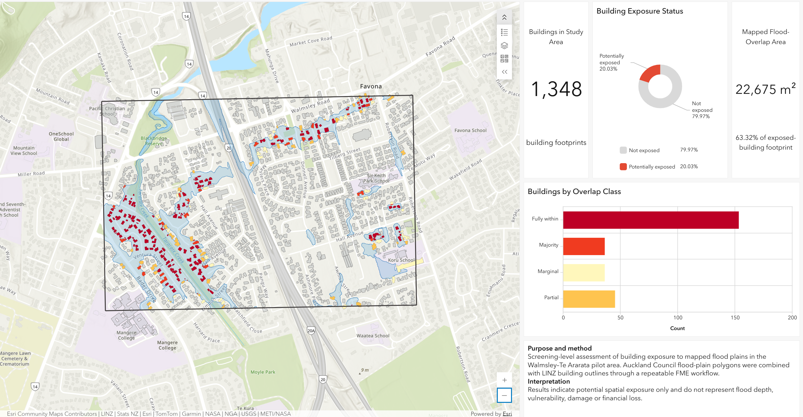
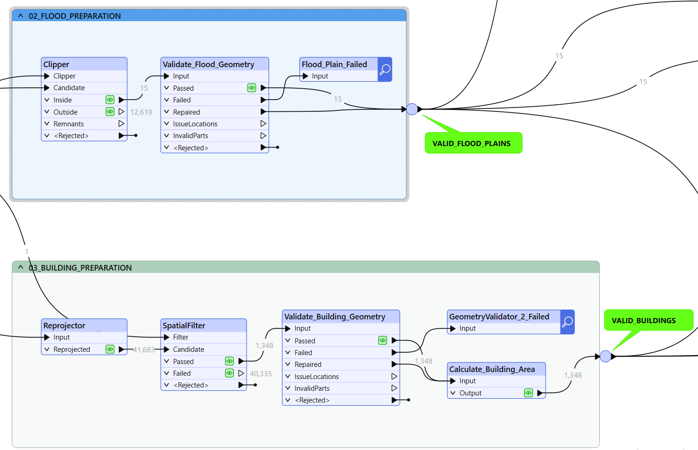

# Walmsley–Te Ararata Building Flood Exposure Screening
A screening-level spatial assessment of building exposure to mapped flood plains in the Walmsley–Te Ararata pilot area, Auckland.

The project uses FME Form to prepare and validate spatial data, compare alternative exposure rules, calculate building-level flood-plain overlap, and publish the results through an ArcGIS Online dashboard.

## Key Results

| Measure | Result |
|---|---:|
| Buildings assessed | 1,348 |
| Buildings intersecting the mapped flood plain | 270 |
| Any-intersection exposure rate | 20.03% |
| Buildings with centroids inside the mapped flood plain | 188 |
| Centroid exposure rate | 13.95% |
| Building-footprint area overlapping the mapped flood plain | 22,674.87 m² |
| Overlap share of exposed-building footprint | 63.32% |

The centroid rule identified 82 fewer buildings than the any-intersection rule, a difference of 6.08 percentage points. This demonstrates that screening results are sensitive to the spatial classification rule applied.

Of the 270 potentially exposed buildings, 153 were fully within the mapped flood plain, 36 had majority overlap, 45 had partial overlap, and 36 had marginal overlap.

## Study Area

The analysis covers an independently defined pilot area around Walmsley Road and Te Ararata Creek in Māngere, Auckland. The boundary was created as a practical processing and reporting extent for this portfolio project; it is not an official catchment or administrative boundary.

## Method

The analysis was implemented as a repeatable FME Form workflow:

1. Clipped 12,628 Auckland Council Flood Plains features to 15 polygons within the pilot area.
2. Reprojected LINZ Building Outlines from NZGD2000 (EPSG:4167) to NZTM2000 (EPSG:2193).
3. Filtered 41,683 source buildings to 1,348 buildings within the study area.
4. Validated flood and building geometries before spatial analysis.
5. Classified buildings using an any-intersection exposure rule.
6. Repeated the assessment using building centroids as a sensitivity test.
7. Calculated the area and percentage of each exposed building footprint overlapping the mapped flood plain.
8. Exported the spatial results and summary tables for publication through ArcGIS Online and ArcGIS Dashboards.

### Data Preparation Workflow

